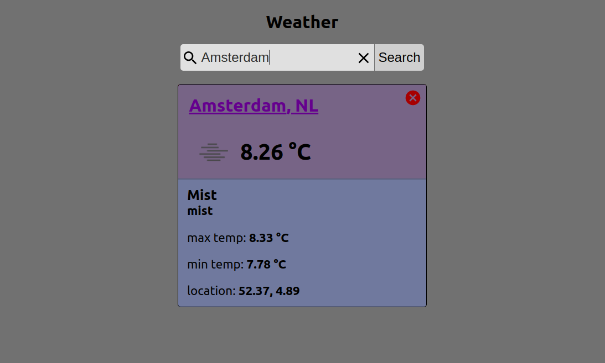
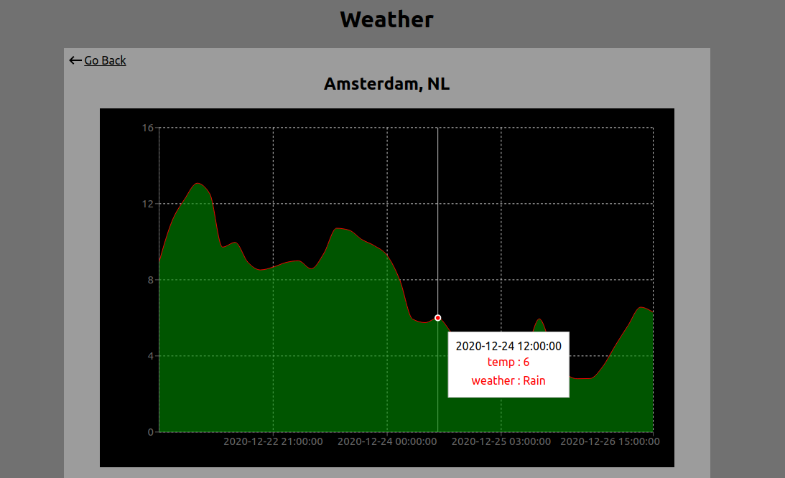

<h1 align="center">Simple Weather App</h1>

### ✨ [Demo](https://hackyourweather4.netlify.app/)




Weather app created using ReactJs, fetch data from OpenWeather API, depend on the city name that you type in the input.

## Install

```sh
git clone git@github.com:Rezan92/hackyourweather.git
hackyourweather
npm install
```

## Usage

1-You need an API KEY from [OpenWeather](https://openweathermap.org/) to use the application, follow the documentation on [OpenWeather](https://openweathermap.org/) to get an API KEY.

2-Run `npm start`

## Author

👤 **Rezan Al Ibrahim**

- Github: [@Rezan](https://github.com/rezan92)
